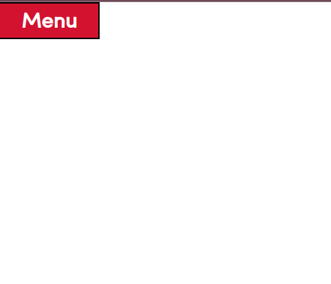

# Drop Down Menu

## ABOUT
A simple drop-down-menu using CSS & JS.
;
;

## OBJECTIVES
- [x] making sure the JS code is reusable. Multiple drop downs can be added with HTML & JS logic can be used to hide/reveal them

## INSTRUCTIONS TO USE
- `addDropDown` function use two arguments `(dropDownButtonId, dropDownContainerId)`. Enter these as parameters and voila!

## CREDITS
- font [Bolt](https://elements.envato.com/bolt-sans-modern-typeface-webfont-N2HPHU)